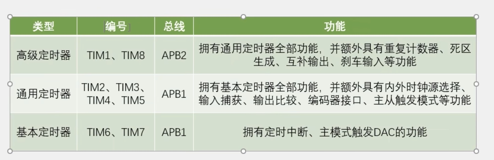

# TIM （Timer）定时器

## 定时器作用

+ 定时器可以对输入的时钟进行计数，并在计数值达到设定值时触发中断
+ 16位计数器、预分频器、自动重装寄存器的时基单元，在72MHzi数时钟下可以实现最大59.65s的定时
+ 不仅具备基本的定时中断功能，而且还包含内外时钟源选择、输入捕获、输出比较、编码器接口、主从触发模式等多种功能
+ 根据复杂度和应用场景分为了高级定时器、通用定时器、基本定时器三种类型
+ 

## 各种定时器的应用场景

1. **PWM 输出**：
   - **TIM2, TIM3, TIM4, TIM5** 常用于产生 PWM 信号，适用于驱动马达、控制 LED 亮度、生成音频信号等。
   - **TIM1 和 TIM8** 支持更高级的 PWM 控制，适用于复杂的电机控制、伺服电机控制等。
2. **输入捕获**：
   - 定时器可以用来捕获外部信号的频率或脉宽，适用于频率测量、脉宽测量等应用。
   - **TIM2, TIM3, TIM4, TIM5** 提供输入捕获功能，可以通过外部信号触发计数，记录信号的时间。
3. **输出比较**：
   - 输出比较功能用于定时器计数到达某个预设值时触发一个事件，适用于定时器控制外部设备的动作，如定时控制一个 LED 闪烁。
   - **TIM2, TIM3, TIM4, TIM5** 支持输出比较功能。
4. **定时中断**：
   - 定时器可以产生定时中断，用于实现定时任务（如定期采样数据、定时更新显示等）。
   - **TIM6 和 TIM7** 提供基本的定时中断功能，适合不需要复杂功能的定时器任务。
5. **同步控制**：
   - **TIM1 和 TIM8** 支持与其他定时器或外部信号的同步，可以实现多定时器协同工作，适合用于复杂的同步控制应用，如电机驱动。

## 定时器分类

## API

# TIM (定时器) 函数列表

### TIM_DeInit
- **功能**: 复位定时器外设的所有寄存器。

### TIM_TimeBaseInit(重要)
- **功能**: 初始化定时器的基础时间设置。
- **参数**: 定时器句柄和配置结构。

### TIM_TimeBaseStructInit
- **功能**: 设置定时器基础结构的默认值。
- **用途**: 初始化定时器配置结构体。

### TIM_Cmd（重要）
- **功能**: 启动或停止定时器。

### TIM_ITConfig（重要）
- **功能**: 配置定时器的中断。

### TIM_InternalClockConfig（重要）
- **功能**: 配置定时器内部时钟源。

### TIM_ITRxExternalClockConfig
- **功能**: 配置定时器接收外部时钟信号的中断。

### TIM_TIxExternalClockConfig
- **功能**: 配置定时器的外部时钟输入。

### TIM_ETRClockMode1Config
- **功能**: 配置定时器的ETR（外部触发）模式1。

### TIM_ETRClockMode2Config
- **功能**: 配置定时器的ETR（外部触发）模式2。

### TIM_ETRConfig
- **功能**: 配置定时器的外部触发设置。

### TIM_PrescalerConfig

+ **描述**：配置定时器的预分频器值。

### TIM_CounterModeConfig

+ **描述**：配置定时器的计数模式。

### TIM_ARRPreloadConfig

+ **描述**：配置定时器自动重载寄存器（ARR）的预加载功能。

### TIM_SetCounter

+ 设置定时器计数器的值。

### TIM_GetCounter

+ **描述**：获取当前定时器计数器的值。

### TIM_GetPrescaler

+ **描述**：获取定时器的预分频器值。

### TIM_GetFlagStatus

+ **描述**：检查特定定时器标志的状态。

### TIM_ClearFlag

+ **描述**：清除指定的定时器标志。

### TIM_GetITStatus

+ **描述**：检查特定中断标志的状态。

### TIM_ClearITPendingBit

+ **描述**：清除特定中断的待处理位。

### TIM2_IRQHandler

+ **描述**：监听器

