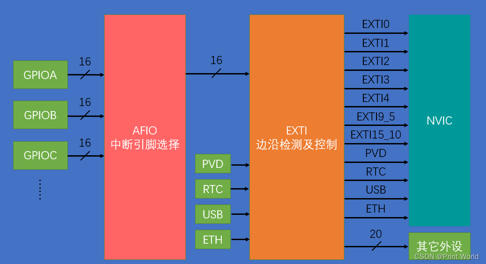
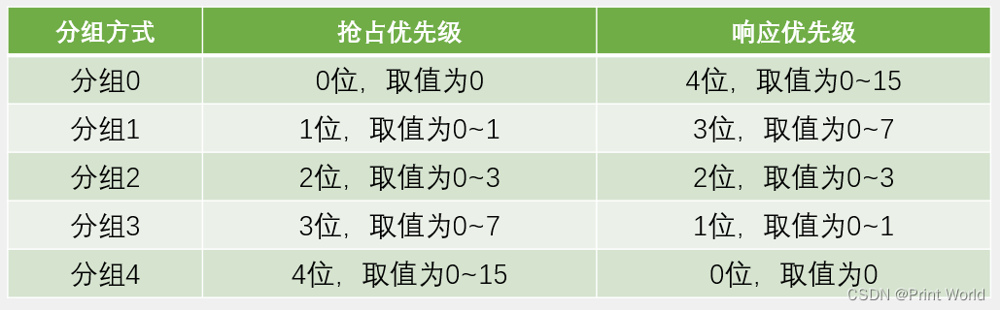

# EXTI外部中断

+ 中断：在主程序运行过程中，出现了特定的中断触发条件（中断源），使得CPU暂停当前正在运行的程序，转而去处理中断程序，处理完成后又返回原来被暂停的位置继续运行

+ 中断优先级：当有多个中断源同时申请中断时，CPU会根据 急的中断源

+ 中断嵌套：当一个中断程序正在运行时，又有新的更高优先级的中断源申请中断，CPU再次暂停当前中断程序，转而去处理新的中断程序，处理完成后依次进行返回

## 中断执行流程

***开启始终->配置GPIO->配置路线重映射（AFIO）->配置exti->配置nvic->监听***

### EXTI 外部中断

+ EXTI可以监测指定GPIO口的电平信号，当其指定的GPIO口产生电平变化时，EXTI将立即向NVIC发出中断申请，经过NVIC裁决后即可中断CPU主程序，使CPU执行EXTI对应的中断程序
+ 支持的触发方式：上升沿/下降沿/双边沿/软件触发
+ 支持的GPIO口：所有GPIO口，但相同的Pin不能同时触发中断
+ 通道数：16个GPIO_Pin，外加PVD输出、RTC闹钟、USB唤醒、以太网唤醒
+ 触发响应方式：中断响应/事件响应

## 总体流程

GPIO->AFIO->EXTI->NVIC->捕获

### GPIO

略

### AFIO（重映射）

- AFIO主要用于引脚复用功能的选择和重定义
- 在STM32中，AFIO主要完成两个任务：复用功能引脚重映射、中断引脚选择

***GPIO_EXTILineConfig(GPIO_PortSourceGPIOB, GPIO_PinSource14); //配置AFIO连接引脚和EXTI***

### EXTI

	初始化配置：
	
	EXTI_InitTypeDef EXTI_InitStructure;						//定义结构体变量
	EXTI_InitStructure.EXTI_Line = EXTI_Line14;					//选择配置外部中断的14号线
	EXTI_InitStructure.EXTI_LineCmd = ENABLE;					//指定外部中断线使能
	EXTI_InitStructure.EXTI_Mode = EXTI_Mode_Interrupt;			//指定外部中断线为中断模式
	EXTI_InitStructure.EXTI_Trigger = EXTI_Trigger_Falling;		//指定外部中断线为下降沿触发
	EXTI_Init(&EXTI_InitStructure);								//将结构体变量交给EXTI_Init，配置EXTI外设

+ EXTI_Line   配置线路
  + EXTI_Line0~EXTI_Line15 是GPIO的引脚
  + EXTI_Line16 连接pvd，用于检测电压变化
  + EXTI_Line17 连接RTC闹钟事件
  + EXTI_Line18 连接USB唤醒事件
  + EXTI_Line19 连接以太网ETH唤醒事件
+ EXTI_LineCmd 开关
+ EXTI_Mode 模式
  +   EXTI_Mode_Interrupt （中断模式）  触发信号生成中断，通过 NVIC 调用中断服务函数
  +   EXTI_Mode_Event （事件模式）触发信号生成事件，但不进入中断服务函数
+ EXTI_Trigger 出发方式
  +  EXTI_Trigger_Rising = 0x08,
  +  EXTI_Trigger_Falling = 0x0C,  
  +  EXTI_Trigger_Rising_Falling = 0x10

### NVIC

分组：

初始化配置：

	/*NVIC配置*/
	NVIC_InitTypeDef NVIC_InitStructure;						//定义结构体变量
	NVIC_InitStructure.NVIC_IRQChannel = EXTI15_10_IRQn;		//选择配置NVIC的EXTI15_10线
	NVIC_InitStructure.NVIC_IRQChannelCmd = ENABLE;				//指定NVIC线路使能
	NVIC_InitStructure.NVIC_IRQChannelPreemptionPriority = 1;	//指定NVIC线路的抢占优先级为1
	NVIC_InitStructure.NVIC_IRQChannelSubPriority = 1;			//指定NVIC线路的响应优先级为1
	NVIC_Init(&NVIC_InitStructure);								//将结构体变量交给NVIC_Init，配置NVIC外设

+ NVIC_IRQChannel  向量表里面找
  + EXTI0
  + EXTI1
  + EXTI2
  + EXTI3
  + EXTI4
  + EXTI9-5
  + EXT15-10
+ NVIC_IRQChannelCmd
+ NVIC_IRQChannelPreemptionPriority
+ NVIC_IRQChannelSubPriority

向量表：

### 监听中断

+  EXTI0_IRQHandler 在终端模式的时候会自动触发，源文件在（start/startup_stm32f10x_md.s）

### API

+ NVIC_PriorityGroupConfig

​	功能: 设置优先级分组：先占优先级和从优先级 

​	参数:    NVIC_PriorityGroup：优先级分组位长度      

​	返回值: 无

​	

