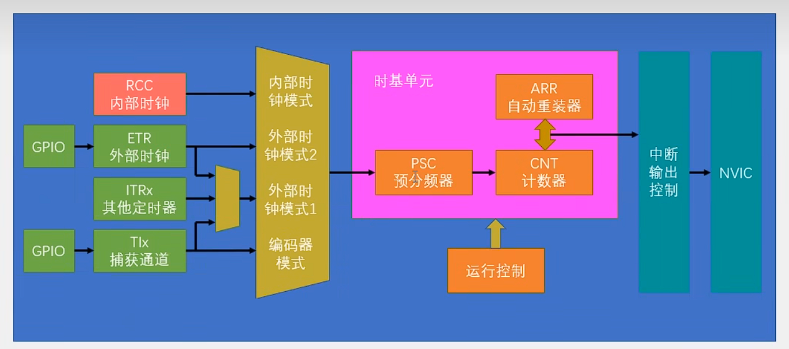

# TIM ETR外部时钟定时器



## 外部中断执行流程

***打开时钟TIm->配置GPIO口-> 配置外部时钟源->配置时基单元->配置终端输出->配置nvic->使能->监听*** 


### 1. 外部时钟模式介绍

STM32 定时器支持以下几种外部时钟模式：

- **ETR（外部触发输入）模式**： 定时器可以配置为从 ETR 引脚接收外部时钟信号，用于定时器计数。
- **TIx（输入捕获通道）模式**： 可以选择使用 TIMx_CH1 或 TIMx_CH2 等通道作为时钟源。适合频率较低的外部脉冲信号。
- **编码器模式**： 针对编码器设计的计数模式，可以通过 A/B 两路信号分别作为 CH1 和 CH2 输入，检测方向和计数。

------

### 2. 配置步骤

以使用 TIM2 的 TI1 引脚 (PA0) 作为外部时钟信号为例，配置流程如下：

#### 2.1 配置时钟和引脚

1. **启用 TIM2 和 GPIOA 的时钟**：

   ```
   RCC_APB1PeriphClockCmd(RCC_APB1Periph_TIM2, ENABLE);  // 启用 TIM2 时钟
   RCC_APB2PeriphClockCmd(RCC_APB2Periph_GPIOA, ENABLE); // 启用 GPIOA 时钟
   ```

2. **配置 PA0 为浮空输入**（外部时钟输入引脚需要配置为输入模式）：

   ```
   GPIO_InitTypeDef GPIO_InitStructure;
   GPIO_InitStructure.GPIO_Pin = GPIO_Pin_0;
   GPIO_InitStructure.GPIO_Mode = GPIO_Mode_IN_FLOATING;
   GPIO_Init(GPIOA, &GPIO_InitStructure);
   ```

#### 2.2 配置 TIM2 以外部时钟模式运行

1. **配置定时器的外部时钟模式**： 使用 `TIM_TIxExternalClockConfig` 配置 TIM2 以 TI1 引脚作为外部时钟源。

   ```
   
   ERT外部时钟
   TIM_ETRClockMode2Config(TIM2, TIM_ExtTRGPSC_OFF, TIM_ExtTRGPolarity_NonInverted, 0x0F);
   
   ```
   
   这里指定 TIM2 的外部时钟源为 TI1，引脚上升沿有效，不使用输入滤波（滤波设置为 0）。

2. **设置 TIM2 计数周期**： 设置自动重装载寄存器（ARR），例如设置为 999，意味着计数到 1000 次触发溢出。

   ```
   TIM_SetAutoreload(TIM2, 999);
   ```
   
3. **启动定时器**：

   ```
   TIM_Cmd(TIM2, ENABLE);
   ```

#### 2.3 配置中断（可选）

如果需要在定时器溢出时触发中断，可以使能 TIM2 的中断：

1. **使能更新中断**：

   ```
   TIM_ITConfig(TIM2, TIM_IT_Update, ENABLE);
   ```
   
2. **配置 NVIC**（Nested Vectored Interrupt Controller）优先级并启用 TIM2 中断：

   ```
   NVIC_InitTypeDef NVIC_InitStructure;
   NVIC_InitStructure.NVIC_IRQChannel = TIM2_IRQn;
   NVIC_InitStructure.NVIC_IRQChannelPreemptionPriority = 0;
   NVIC_InitStructure.NVIC_IRQChannelSubPriority = 1;
   NVIC_InitStructure.NVIC_IRQChannelCmd = ENABLE;
   NVIC_Init(&NVIC_InitStructure);
   ```

3. **编写中断处理函数**： 在定时器溢出时执行中断服务函数。比如在 TIM2 溢出时，切换一个 LED 的状态：

   ```
   void TIM2_IRQHandler(void) {
       if (TIM_GetITStatus(TIM2, TIM_IT_Update) != RESET) {
           TIM_ClearITPendingBit(TIM2, TIM_IT_Update);
           GPIOA->ODR ^= GPIO_Pin_5;  // 切换 LED 状态
       }
   }
   ```

------

### 3. 关键参数和配置说明

- **外部时钟极性**：设置输入捕获极性（上升沿或下降沿触发）。
- **滤波设置**：可以根据噪声情况设置滤波器。TIM2 有滤波器，可以滤除较短的毛刺。
- **预分频器**：通过设置预分频器降低计数频率。`TIM_Prescaler` 设置定时器计数频率，用于适应外部时钟频率。

------

### 4. 应用示例

- **脉冲计数**：可以使用外部时钟计数功能统计传感器脉冲次数，如红外传感器。
- **频率测量**：通过定时器的外部时钟模式，可以测量输入信号的频率。
- **编码器接口**：通过外部输入，定时器可以检测旋转编码器的脉冲，实现旋转方向和速度的监控。

------

### 5. 注意事项

- **引脚配置**：确保外部时钟输入引脚配置正确。
- **中断频率控制**：在高频输入时，计数速度会增加，需合理设置中断和计数上限（ARR）以防止处理不过来。
- **外部时钟稳定性**：外部时钟信号应稳定、无毛刺，必要时使用滤波器。