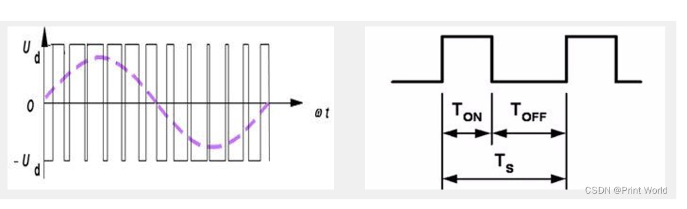
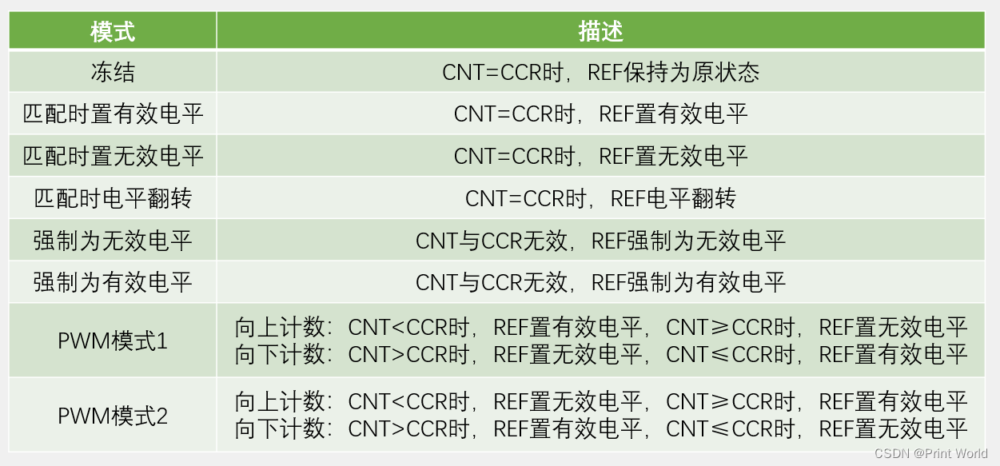
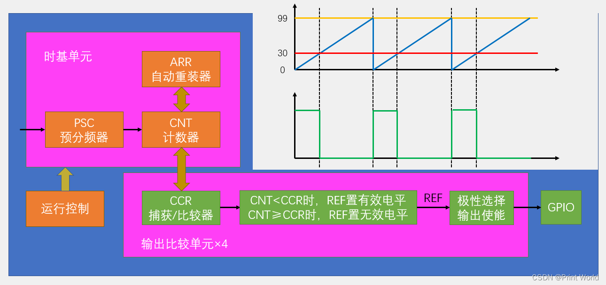
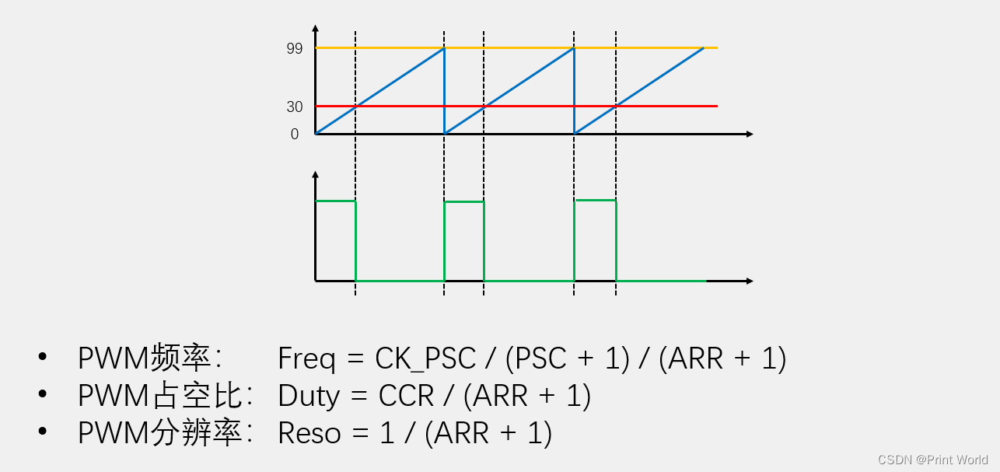

# OC 输出比较

## 输出比较简介

+ OC（Output Compare）输出比较
+ 输出比较可以通过比较CNT与CCR寄存器值的关系，来对输出电平进行置1、置0或翻转的操作，用于输出一定频率和占空比的PWM波形
+ 每个高级定时器和通用定时器都拥有4个输出比较通道
+ 高级定时器的前3个通道额外拥有死区生成和互补输出的功能

## 示例

+ 呼吸灯
+ 舵机控制
+ pwm驱动直流电机

## PWM简介

+ 用来调光的原理就是利用切换亮光的速度和频率来调整亮度
+ PWM（Pulse Width Modulation）脉冲宽度调制
+ 具有惯性的系统中，可以通过对一系列脉冲的宽度进行调制，来等效地获得所需要的模拟参量，常应用于电机控速等领域
+ PWM参数：
  + 频率 = 1 / TS 
  + 占空比 = TON / TS 
  + 分辨率 = 占空比变化步距

## 输出比较模式

## PWM基本结构

## PWM 参数计算

72 000 000 / psc/arr =  

## 舵机简介

- 输入PWM信号要求：周期为20ms，高电平宽度为0.5ms~2.5ms

  

## 直流机及驱动

- 直流电机是一种将电能转换为机械能的装置，有两个电极，当电极正接时，电机正转，当电极反接时，电机反转
- 直流电机属于大功率器件，GPIO口无法直接驱动，需要配合电机驱动电路来操作
- TB6612是一款双路H桥型的直流电机驱动芯片，可以驱动两个直流电机并且控制其转速和方向

TB6612FNG模块 输入电压建议12V或者以内

该模块相对于传统的**L298N**效率上提高很多,体积上也大幅度减少，在额定范围内，芯片基本不发热，当然也就显得更加娇贵,所以我们建议有一定动手能力的朋友使用,接线的时候务必细心细心再细心，注意正负极性。

## 代码流程

***打开时钟TIm->配置gpio口-> 配置时钟源->配置时基单元-> 配置输出比较 ->使能*** 

### 配置输出比较

	TIM_OCInitTypeDef TIM_OCInitStructure;							//定义结构体变量
	TIM_OCStructInit(&TIM_OCInitStructure);							//结构体初始化，若结构体没有完整赋值
																	//则最好执行此函数，给结构体所有成员都赋一个默认值
																	//避免结构体初值不确定的问题
	TIM_OCInitStructure.TIM_OCMode = TIM_OCMode_PWM1;				//输出比较模式，选择PWM模式1
	TIM_OCInitStructure.TIM_OCPolarity = TIM_OCPolarity_High;		//输出极性，选择为高，若选择极性为低，则输出高低电平取反
	TIM_OCInitStructure.TIM_OutputState = TIM_OutputState_Enable;	//输出使能
	TIM_OCInitStructure.TIM_Pulse = 0;								//初始的CCR值
	TIM_OC1Init(TIM2, &TIM_OCInitStructure);

