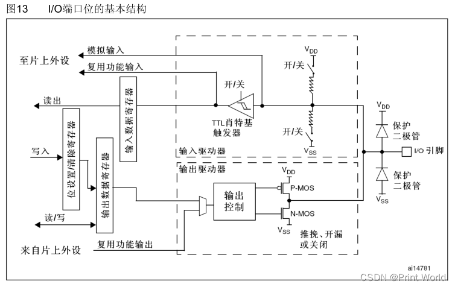

# GPIO



4种输入：

1. 输入浮空
   + 引脚浮空，高低电平不确定
2. 输入上拉
   + 引脚浮空，默认高电平，否则按照实际来输入
3. 输入下拉
   + 引脚浮空，默认低电平，否则按照实际来输入
4. 模拟输入
   + 模拟输入模式下，I/O端口的模拟信号（电压信号，而非电平信号）直接模拟输入到片上外设模块，比如ADC模块等等。

> 上拉下拉取决于悬空时候的输入输出。其他情况下按照实际情况来。


4种输出：

1. 开漏输出
   1. pmose无效，只有nmose在工作
   2. 输入1时，nmose断开，高阻模式
   3. 输入0时，nmose导入，输出低电平
   4. 这种模式只有低电平有驱动能力
   5. 一般通信
   6. 可以输出5v电瓶信号

2. 开漏复用输出
3. 推挽输出
   1. 输入1，pmos 连接，输出高电平
   2. 输入0，nmose连接，输出低电平
   3. 是一种强有力驱动能力的强推模式

4. 复用推挽输出


3中最大翻转速度：

1.  2MHZ
2.  10MHZ
3.  50MHZ


## API

1. 开启GPIOB的时钟

   ```
   RCC_APB2PeriphClockCmd(RCC_APB2Periph_GPIOB, ENABLE)
   第一个参数
     *           RCC_APB2Periph_AFIO, RCC_APB2Periph_GPIOA, RCC_APB2Periph_GPIOB,
     *          RCC_APB2Periph_GPIOC, RCC_APB2Periph_GPIOD, RCC_APB2Periph_GPIOE,
     *          RCC_APB2Periph_GPIOF, RCC_APB2Periph_GPIOG, RCC_APB2Periph_ADC1,
     *          RCC_APB2Periph_ADC2, RCC_APB2Periph_TIM1, RCC_APB2Periph_SPI1,
     *          RCC_APB2Periph_TIM8, RCC_APB2Periph_USART1, RCC_APB2Periph_ADC3,
     *          RCC_APB2Periph_TIM15, RCC_APB2Periph_TIM16, RCC_APB2Periph_TIM17,
     *          RCC_APB2Periph_TIM9, RCC_APB2Periph_TIM10, RCC_APB2Periph_TIM11 
   第二个参数
   typedef enum {DISABLE = 0, ENABLE = !DISABLE} FunctionalState;
   ```

   

2. GPIO初始化

   ```
   	GPIO_InitStructure.GPIO_Mode = GPIO_Mode_Out_PP;		//GPIO模式，赋值为推挽输出模式
   	GPIO_InitStructure.GPIO_Pin = GPIO_Pin_12;				//GPIO引脚，赋值为第12号引脚
   	GPIO_InitStructure.GPIO_Speed = GPIO_Speed_50MHz;
   	
   	GPIO_Init(GPIOB, &GPIO_InitStructure);//初始化
   ```

   

3. GPIO调用输入输出

   初始化

   ----

   

   + void GPIO_DeInit(GPIO_TypeDef* GPIOx);

     + 功能: 将外设 GPIOx 寄存器重设为缺省值 
     + 参数: GPIOx：x 可以是 A，B，C，D 或者 E，来选择 GPIO 外设 
     + 返回值: 无

   + void GPIO_AFIODeInit(void);

     + 功能: 将复用功能（重映射事件控制和 EXTI 设置）重设为缺省值 
     + 参数: 无 
     + 返回值: 无

   + void GPIO_Init(GPIO_TypeDef* GPIOx, GPIO_InitTypeDef* GPIO_InitStruct);

     + 功能:根据 GPIO_InitStruct 中指定的参数初始化外设 GPIOx 寄存器
     + 参数:GPIOx：x 可以是 A，B，C，D 或者 E，来选择 GPIO 外设
           GPIO_InitStruct：指向结构 GPIO_InitTypeDef 的指针，包含了外设 GPIO 的配置信息    
     + 回值:无

   + void GPIO_StructInit(GPIO_InitTypeDef* GPIO_InitStruct);

     + 功能: 把 GPIO_InitStruct 中的每一个参数按缺省值填入 
     + 参数: GPIO_InitStruct：指向结构 GPIO_InitTypeDef 的指针，待初始化    
     + 返回值: 无

     

     

     读取输入输出

     ----

     

   + uint8_t GPIO_ReadInputDataBit(GPIO_TypeDef* GPIOx, uint16_t GPIO_Pin);

     + 功能: 读取指定端口管脚的输入 
     + 参数: 
       + GPIOx：x 可以是 A，B，C，D 或者 E，来选择 GPIO 外设    
       + GPIO_Pin：待读取的端口位     
     + 返回值: 输入端口管脚值

   + uint16_t GPIO_ReadInputData(GPIO_TypeDef* GPIOx);

     + 功能: 读取指定的 GPIO 端口输入 
     + 参数: GPIOx：x 可以是 A，B，C，D 或者 E，来选择 GPIO 外设 
     + 返回值: GPIO输入数据端口值

   + uint8_t GPIO_ReadOutputDataBit(GPIO_TypeDef* GPIOx, uint16_t GPIO_Pin);

     + 功能: 读取指定端口管脚的输出 
     + 参数: 
       + GPIOx：x 可以是 A，B，C，D 或者 E，来选择 GPIO 外设    
       + GPIO_Pin：待读取的端口位     
     + 返回值: 输出端口管脚值

   + uint16_t GPIO_ReadOutputData(GPIO_TypeDef* GPIOx);

     + 功能: 读取指定的 GPIO端口输出 
     + 参数: GPIOx：x 可以是 A，B，C，D 或者 E，来选择 GPIO 外设  
     + 返回值: GPIO输出数据端口值

     

     设置高低电平

     -----

     

   + void GPIO_SetBits(GPIO_TypeDef* GPIOx, uint16_t GPIO_Pin);

     + 功能: 设置指定的数据端口位 
       + 参数: GPIOx：x 可以是 A，B，C，D 或者 E，来选择 GPIO 外设    
       + GPIO_Pin：待设置的端口位     
     + 返回值: 无

   + void GPIO_ResetBits(GPIO_TypeDef* GPIOx, uint16_t GPIO_Pin);

     + 功能: 清除指定的数据端口位 
     + 参数: 
       + GPIOx：x 可以是 A，B，C，D 或者 E，来选择 GPIO 外设    
       + GPIO_Pin：待设置的端口位     
     + 返回值: 无

   + void GPIO_WriteBit(GPIO_TypeDef* GPIOx, uint16_t GPIO_Pin, BitAction BitVal);

     + 功能: 设置或者清除指定的数据端口位 
     + 参数: 
       + GPIOx：x 可以是 A，B，C，D 或者 E，来选择 GPIO 外设    
       + GPIO_Pin：待设置或者清除指的端口位  
     + 返回值: 无

   + void GPIO_Write(GPIO_TypeDef* GPIOx, uint16_t PortVal);

     + 功能: 向指定 GPIO 数据端口写入数据 
     + 参数: 
       + GPIOx：x 可以是 A，B，C，D 或者 E，来选择 GPIO 外设    
       + PortVal: 待写入端口数据寄存器的值 
     + 返回值: 无

   + void GPIO_PinLockConfig(GPIO_TypeDef* GPIOx, uint16_t GPIO_Pin);

     + 功能: 使能或者失能 APB2 外设时钟 
     + 参数: 
       + RCC_APB2Periph: 门控 APB2 外设时钟    
       + NewState：指定外设时钟的新状态 
     + 返回值: 无  

   

   配置

   ----

   

   + void GPIO_EventOutputConfig(uint8_t GPIO_PortSource, uint8_t GPIO_PinSource);
   + void GPIO_EventOutputCmd(FunctionalState NewState);
   + void GPIO_PinRemapConfig(uint32_t GPIO_Remap, FunctionalState NewState);
   + void GPIO_EXTILineConfig(uint8_t GPIO_PortSource, uint8_t GPIO_PinSource);
   + void GPIO_ETH_MediaInterfaceConfig(uint32_t GPIO_ETH_MediaInterface);

   


