# stm32F103C8T6

+ 命名规则	

  + stem32 基于arm核心的32位微控制器
  + F通用类型

    + 103
      + 101  基本型
      + 102 useb基本型 ，usb2.0全速设别
      + 103增强型
      + 105或107 互联型

    + C 针脚数量
      + T =36脚
      + C =48脚
      + R =64脚
      + V =100脚 
      + Z =144脚

    + 8 闪存容量
      + 4 = 16k
      + 6=32k
      + 8=64k
      + B=128k
      + C=256k
      + D=384k
      + E=512k

    + T 封装类型
      + H =BGA
      + T =LQFP
      + U = VFQFPN
      + Y = WLCSP64
  + 6温度
    + 6= -40℃~65℃
      + 7=-40℃~105℃

## 器件图示

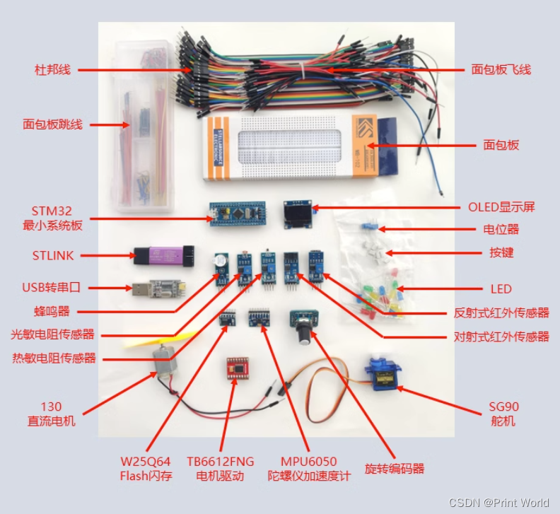

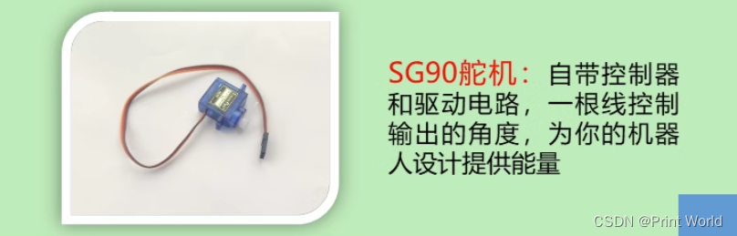

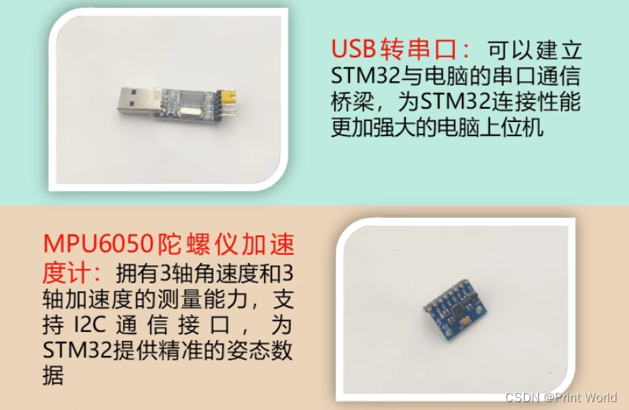

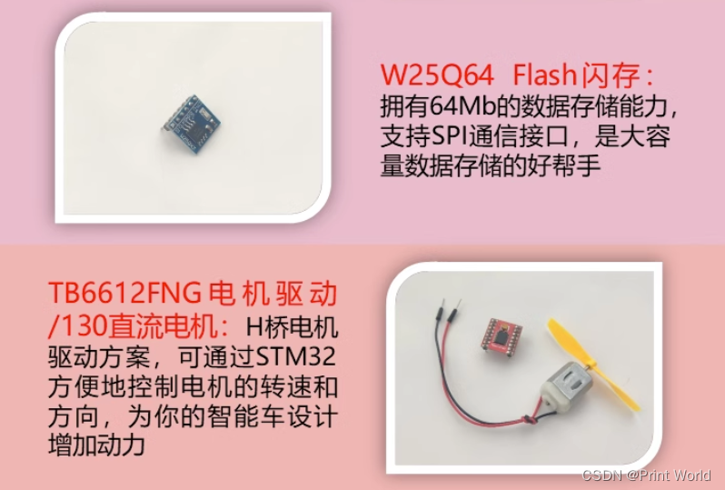

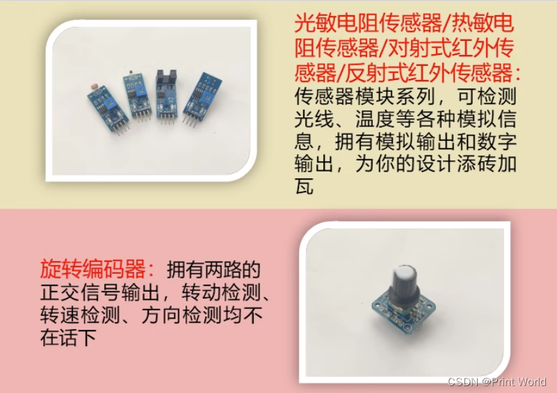

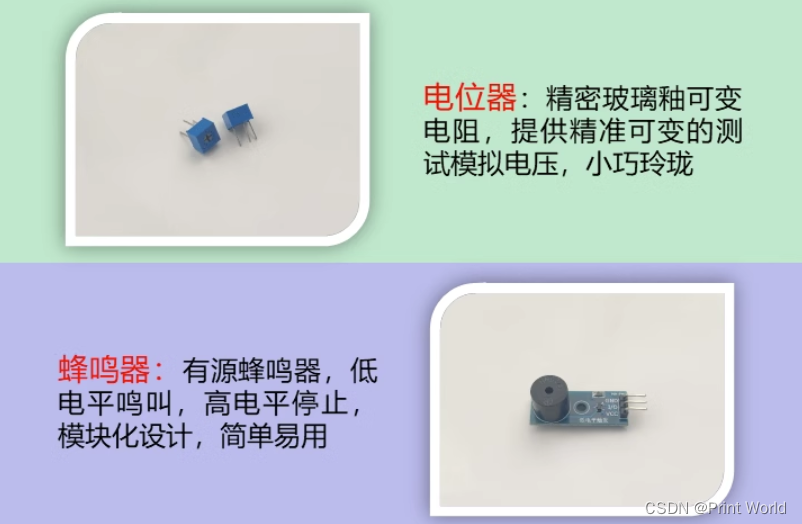

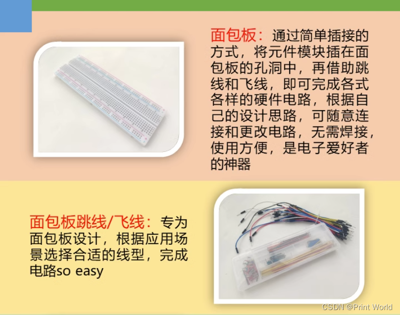

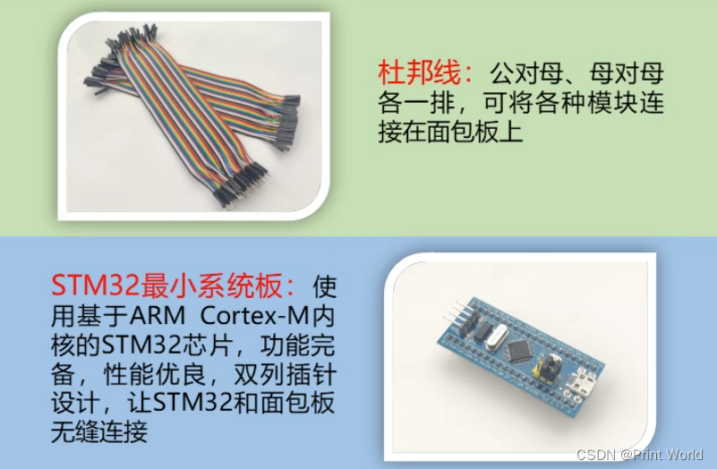

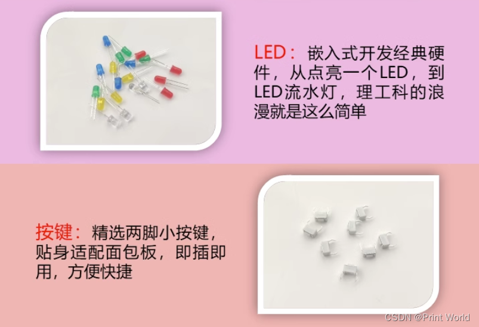

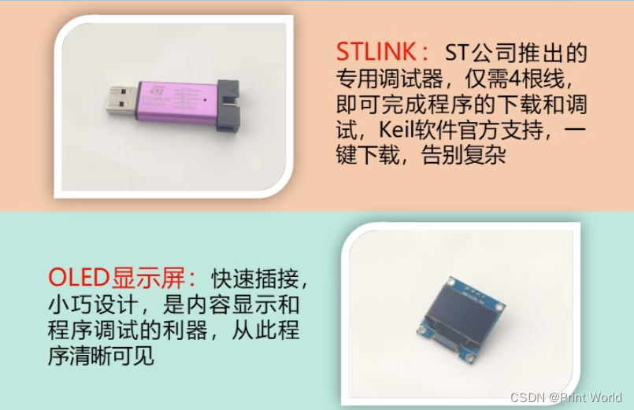

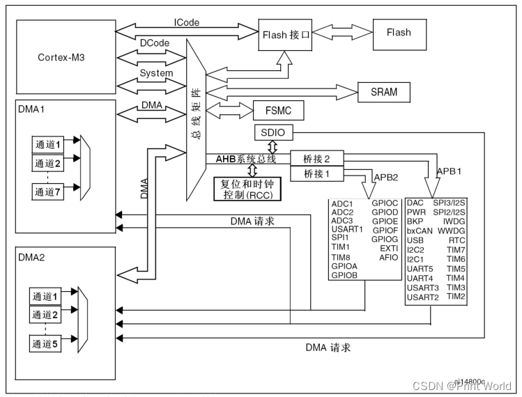

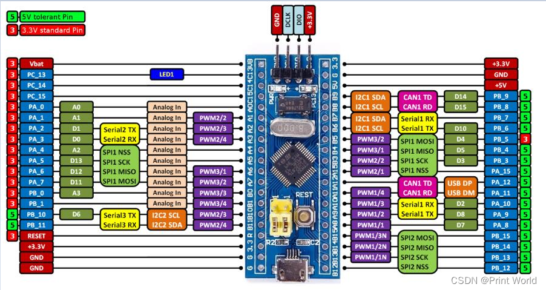

1. I = 输入，O = 输出，S = 电源， HiZ = 高阻
2. FT：容忍5V
3. 可以使用的功能依选定的型号而定。对于具有较少外设模块的型号，始终是包含较小编号的功能模块。例如，某个型号只有1个SPI和2个USART时，它们即是SPI1和USART1及USART2。
   PC13，PC14和PC15引脚通过电源开关进行供电，而这个电源开关只能够吸收有限的电流(3mA)。因此这三个引脚作为输出引脚时有以下限制：在同一时间只有一个引脚能作为输出，作为输出脚时只能工作在2MHz模式下，最大驱动负载为30pF，并且不能作为电流源(如驱动LED)。
4. 这些引脚在备份区域第一次上电时处于主功能状态下，之后即使复位，这些引脚的状态由备份区域寄存器控制（这些寄存器不会被主复位系统所复位）。 关于如何控制这些IO口的具体信息，请参考STM32F10xxx参考手册的电池备份区域和BKP寄存器的相关章节。
5. 与LQFP64的封装不同，在TFBGA64封装上没有PC3，但提供了V REF+ 引脚。
   此类复用功能能够由软件配置到其他引脚上(如果相应的封装型号有此引脚)，详细信息请参考STM32F10xxx参考手册的复用功能I/O章节和调试设置章节。
6. VFQFPN36封装的引脚2和引脚3、LQFP48和LQFP64封装的引脚5和引脚6、和TFBGA64封装的C1和C2，在芯片复位后默认配置为OSC_IN和OSC_OUT功能脚。软件可以重新设置这两个引脚为PD0和PD1功能。但对于LQFP100/BGA100封装，由于PD0和PD1为固有的功能引脚，因此没有必要再由软件进行重映像设置。更多详细信息请参考STM32F10xxx参考手册的复用功能I/O章节和调试设置章节。在输出模式下，PD0和PD1只能配置为50MHz输出模式。

硬件资源

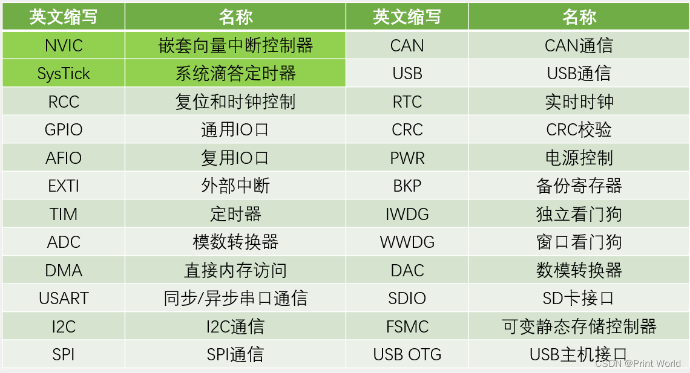

