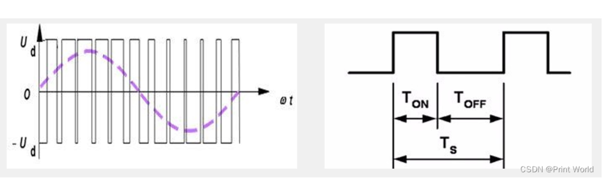
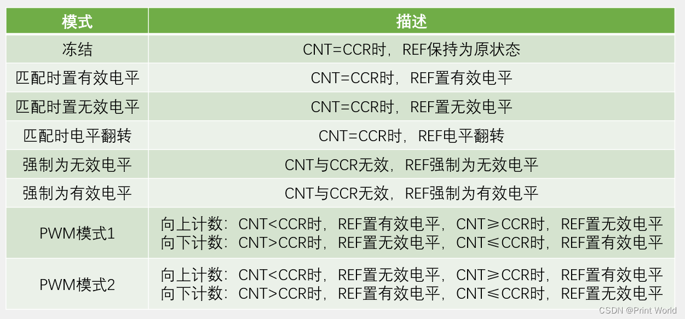
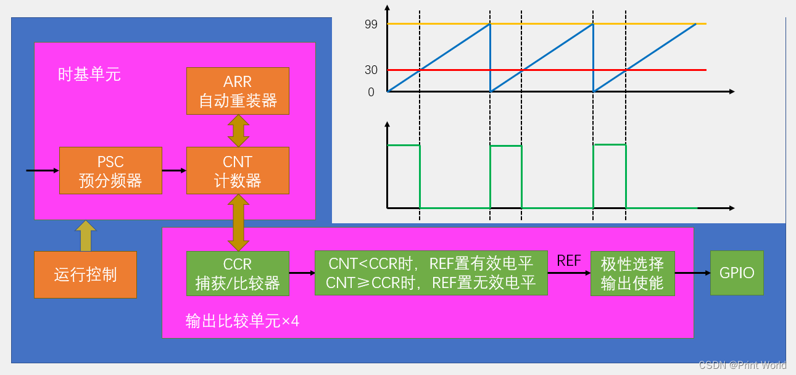

# OC 输出比较

## 输出比较简介

+ OC（Output Compare）输出比较
+ 输出比较可以通过比较CNT与CCR寄存器值的关系，来对输出电平进行置1、置0或翻转的操作，用于输出一定频率和占空比的PWM波形
+ 每个高级定时器和通用定时器都拥有4个输出比较通道
+ 高级定时器的前3个通道额外拥有死区生成和互补输出的功能

## 示例

+ 呼吸灯
+ 舵机控制
+ pwm驱动直流电机

## PWM简介

+ 用来调光的原理就是利用切换亮光的速度和频率来调整亮度
+ PWM（Pulse Width Modulation）脉冲宽度调制
+ 具有惯性的系统中，可以通过对一系列脉冲的宽度进行调制，来等效地获得所需要的模拟参量，常应用于电机控速等领域
+ PWM参数：
  + 频率 = 1 / TS 
  + 占空比 = TON / TS 
  + 分辨率 = 占空比变化步距

## 输出比较模式

## PWM基本结构

## PWM 参数计算

