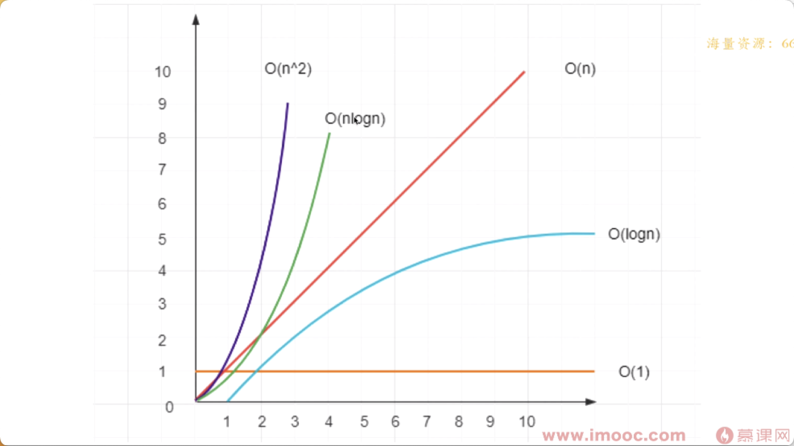
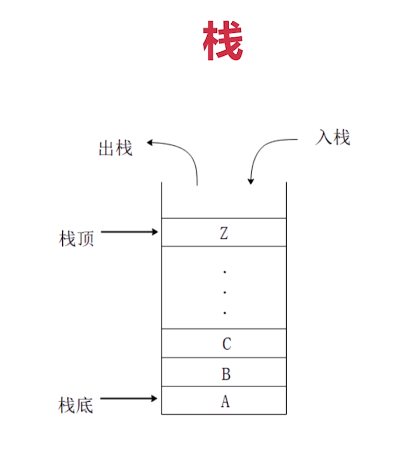
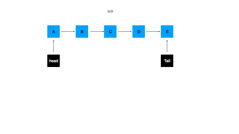
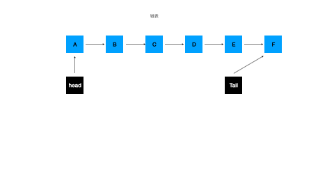
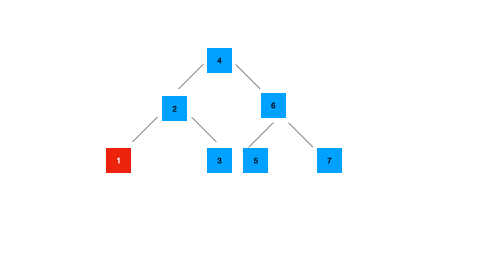
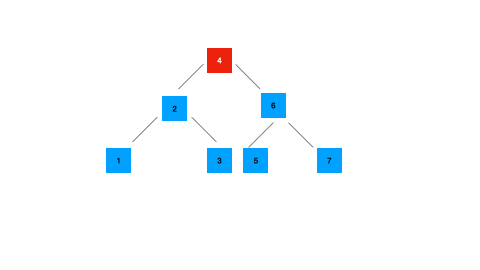
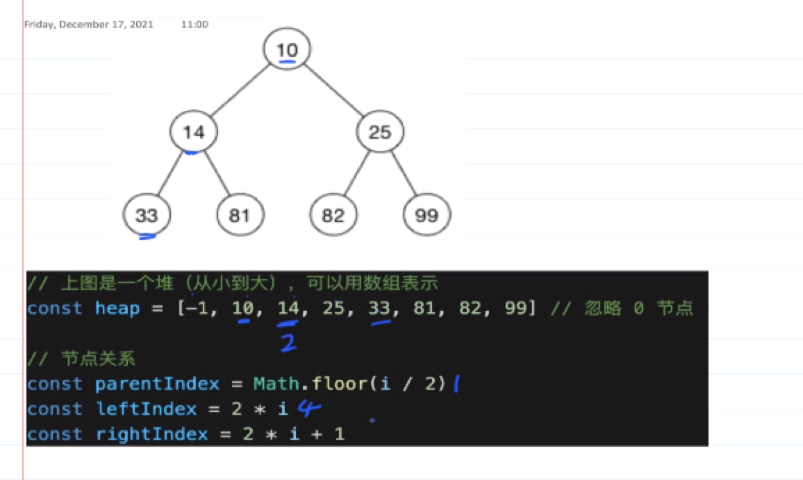

# 算法


### 1、算法的复杂度

+ 程序执行时需要的计算量和内存空间（和代码是否简洁无关）
+ 复杂度是***数量级***（方便记忆、推广），不是具体的数字
+ 一般针对一个具体的算法，而非一个完整的系统 




1. O(1)  执行一次

   时间复杂度：逻辑代码写出来的都是O(1)

   空间复杂度：const

2. O(n) 输入多少执行多少次

   一次for循环就是o(n)

3. O(logn) 成对数形式 比如输入100次，执行10次

   二分法就是

4. O(nlogn)

​	  循环+二分法		

5. O(n^2) 输入多少次，就是平方的复杂度

​	  两个for循环嵌套就是O(n^2)

前端重时间复杂度，轻控件复杂度


### 2、将一个数组旋转k步

案例:输入arr = [1,23,4,5,6,7] k = 3

结果：[5,6,7,1,23,4]

分析思路：

1. 使用for循环，将第k步的数据一步一步unshfit到数组之前
2. 使用拆分方法，讲数组组成新的数组

```javascript

export function rote(arr: Array<number> = [], k: number): number[] {
    if (!k || arr.length == 0) return arr
    const step = Math.abs(k % arr.length)
    for (let i = 0; i < step; i++) {
        let popval = arr.pop()
        if (popval) {
            arr.unshift(popval)
        }
    }
    return arr
}

export function rote2(arr: Array<number> = [], k: number): number[] {
    if (!k || arr.length == 0) return arr
    const step = Math.abs(k % arr.length)
    const arr1 = arr.slice(-step)
    const arr2 = arr.slice(0, arr.length - step)
    const arr3 = arr1.concat(arr2)
    return arr3;
}
```


+ 第一种：
  + 时间复杂度为O(n^2),for一次，unshift一次，
  + 空间复杂度O(1): 元数组进行操作
+ 第二种：
  + 时间复杂度O(1):
  + 空间复杂度O(n): 使用到了arr1,arr2,arr3，三个内存大小，和n属于同一级别，所以是O(n)

前端重时间，次空间，所以第二种思路比较好


### 3、判断字符串是否是括号匹配

栈：先进后出

```javascript
const stack = [];
stack.push(1)
stack.push(2)
stack.push(3)
stack.pop() // 3
```

*** 栈和数组有什么区别***

+ 栈是逻辑结构。理论模型，不管如何实现，不收语言的限制
+ 数组是物理结构，真实的功能实现，受编程语言限制




题目：一个字符串s可能包括{},[],()

```typescript
function isMach(str: string, arr: Array<string>): boolean {
    if (arr.length > 0) {
        const lastValue = arr[arr.length - 1]
        if (str === "}" && lastValue === "{") return true
        if (str === "{" && lastValue === "}") return true
        if (str === "[" && lastValue === "]") return true
        if (str === "]" && lastValue === "[") return true
        if (str === ")" && lastValue === "(") return true
        if (str === "(" && lastValue === ")") return true
    } else {
        return false
    }

}

// 判断符号字符是否对称
export function isMirror(str: string): boolean {
    if (!str) return false
    let fh = '[]{}()'
    let arr = []
    for (let i = 0; i < str.length; i++) {
        if (fh.includes(str[i])) {
            if (isMach(str[i], arr)) {
                console.log(arr)
                arr.pop()
            } else {
                arr.push(str[i])
            }
        }
    }
    return arr.length <= 0
}
```

+ 空间复杂度：O(n)
+ 时间复杂度：O(n)


### 4、两个栈实现一个队列

 队列：先进先出 

思路：两个栈

+ 添加功能（入栈）：在stack1中push就行
+ 删除功能（出栈）：先循环出栈到stack2中，再在stack2中出栈，在循环入栈到stack1中

```typescript
export class Queue {
    private stack1: Array<any> = [];
    private stack2: Array<any> = [];
    add(val) {
        this.stack1.push(val)
    }

    delete() {
        //先出栈到stack2中
        while (this.stack1.length) {
            const value = this.stack1.pop()
            if (value) {
                this.stack2.push(value)
            }
        }
        // 删除
        this.stack2.pop()
        // 出站到stack1中
        while (this.stack2.length) {
            const value = this.stack2.pop()
            if (value) {
                this.stack1.push(value)
            }
        }
    }

    get length(): number {
        return this.stack1.length
    }
}
```


### 5、使用数组实现一个链表

​	链表：

+ 列表是一种物理结构，非逻辑结构，类似于数组
+ 数组需要一段连续的内存区间而列表是零散的
+ 联调表节点的数据结构｛value,next?,prev?｝

+ 链表分为 双向链表和单项链表

```typescript
interface nodeList<T> {
    value: T,
    next?: nodeList<T>
}
function createLinkList<T>(arr: Array<T>): nodeList<T> | {} {
    if (arr.length <= 0) return {}
    let nodeList: nodeList<T> = {
        value: arr[arr.length - 1],
    }
    if (arr.length === 1) return nodeList;
    for (let i = arr.length - 2; i >= 0; i--) {
        nodeList = {
            value: arr[i],
            next: nodeList
        }
    }
    return nodeList
}

let arr = [1, 20304, 4212, 22]
console.log(createLinkList(arr))
```

### 6、链表Vs数组

+ 都是有序结构
+ 链表：查询慢O(n),新增和删除块O(1)
+ 数组：查询块O(1),新增和删除慢O(n)


### 7、链表实现入队列的入栈出站

思路：

​	入栈：先再队列的顶部添加一个栈，再让tail指向新增栈点



​	出栈：先在队的头部把head指向A的next，再去删除A的next



注意length要在删除的时候和添加的时候都需要记录，遍历记录会添加复杂度

疑问：问什么不能再head入栈，tail出栈呢，再head入栈没有问题，时间复杂度都是O(1),但是tail出栈的话，箭头会先往前一个栈去找，这样的话要去便利所有的链表，使得复杂度会提升到O(n)

```typescript

export interface nodeList<T> {
    value: T,
    next?: nodeList<T>
}


// 使用链表实现一个类，功能来实现队列入栈出站
class linkListQueue<T> {
    private header: nodeList<T> = null
    private tail: nodeList<T> = null
    private length: number = 0
    add(value: T) {
        const newList: nodeList<T> = {
            value: value,
            next: null
        }
        //考虑到空的时候，header也需要指向第一个
        if (!this.header) {
            this.header = newList
        }
        // 真长情况 tail是最后一个的时候，把他的next指向新家的，最后吧tail指向新家的node
        if (this.tail) {
            this.tail.next = newList
        }
        this.tail = newList
        this.length++
    }

    delete() {
        if (this.length <= 0) return
        this.header = this.header.next
        this.length--
    }

    get lenth() {
        return this.length
    }
}	
```

### 8、数组vs链表队列出站

+ 空间复杂度都是O(n)
+ add时间复杂度：链表O(1)，数组O(1)
+ delect时间复杂度：O(1)，数组O(n)，因为数组是shift出栈

### 9、二分法查找O(logn)

只要是有序的数组，基本都是要二分法，

```typescript

/**
 * @name: 二分法查找有序数组
 * @description: 
 * @return {*}
 */
function spiltMidle(target: number, arr: Array<number>) {
    if (!target) return
    if (arr.length <= 0) return
    let start: number = 0
    let end: number = arr.length
    while (start <= end) {
        let middle = Math.floor((end + start) / 2)
        let midValue = arr[middle]
        if (midValue > target) {
            //  向后分
            end = middle - 1
        } else if (midValue < target) {
            //中间分
            start = midValue + 1

        } else {
            //相等
            return middle
        }
    }
}

```


### 10、有序数组中找到两数之和等于某个数

1. 循环嵌套找：O(n^2) 

   ```typescript
   function addGetSum(arr: Array<number>, target: number) {
       let result = []
       for (let i = 0; i < arr.length; i++) {
           for (let j = i + 1; j < arr.length; j++) {
               console.log([arr[i], arr[j]])
               if (arr[i] + arr[j] === target) {
                   result.push([i, j])
               }
           }
   
       }
       return result
   }
   
   ```

   

2. 利用递增（有序）的特性 .双指针，时间复杂度降低到O(n)

   + 随便找两个数
   + 如果大于n，则需要向前寻找
   + 如果小于n，则需要向后寻找——二分法

   ```typescript
   /**
    * @name: 有序列表实现 两个元素相加等于给的值
    * @description: 双指针 O(n)
    * @return {*}
    * @param {Array} arr
    * @param {number} target
    */
   function addGetSum2(arr: Array<number>, target: number) {
       let start = 0
       let end = arr.length - 1
       let result = []
       while (start < end) {
           debugger
           const sum = arr[start] + arr[end];
           if (sum < target) {
               end++
           } else if (sum > target) {
               start++
           } else {
               result.push(start, end)
               break
           }
   
       }
       return result
   }
   ```

   ### 11、二叉树

   + 中序遍历:left->root->right 

     

     前序遍历 :root->left->right

     

   + 后序遍历:left->right->root

     	

     无论哪种树，主要看执行root的执行顺序，如果在中间，就是中序遍历，如果在前面就是前序遍历，如果在后面就是后序遍历。

     

     ```typescript
     /*
      * @Author: kongfanrong
      * @Date: 2022-12-18 11:32:09
      * @LastEditors: kongfanrong
      * @LastEditTime: 2022-12-18 12:00:36
      * @Description: file content
      */
     
     interface ITreeList {
         value: number,
         left?: ITreeList,
         right?: ITreeList,
     }
     
     
     let data: ITreeList = {
         value: 4,
         left: {
             value: 2,
             left: {
                 value: 1
             },
             right: {
                 value: 3
             }
         },
         right: {
             value: 6,
             left: {
                 value: 5
             },
             right: {
                 value: 7
             }
         }
     }
     
     /**
      * @name: 二叉树寻找 第k个值
      * @description: 
      * @return {*}
      */
     function bst(tree: ITreeList, k: number) {
         let ar = []
         middleEach(tree, ar)
         return ar[k]
     }
     
     //中序遍历
     function middleEach(tree: ITreeList, arr: number[]) {
         if (!tree) return
         middleEach(tree.left, arr)
         arr.push(tree.value)
         middleEach(tree.right, arr)
     }
     //前序
     function frontEach(tree: ITreeList, arr: number[]) {
         if (!tree) return
         arr.push(tree.value)
         frontEach(tree.left, arr)
         frontEach(tree.right, arr)
     }
     //后续
     function backEach(tree: ITreeList, arr: number[]) {
         if (!tree) return
         backEach(tree.left, arr)
         backEach(tree.right, arr)
         arr.push(tree.value)
     }
     
     
     console.log(bst(data, 3))
     ```

     

### 11、为什么要用二叉树O(logn)

+ 数组：查找快O(1),增删慢O(n)
+ 链表：查找快O(1),增删慢O(n)
+ 二叉树搜索数BST：查找快，曾删块-“木桶快”

### 12、堆栈模型

1. 堆
   + 完全二叉树
   + 最大堆：父节点>=子节点
   + 最小堆：父节点<=子节点

BST：左节点<根节点<右节点

满二叉树：左右的节点都是有的

完全二叉树：左节点有，右节点没有

堆：

​	最大堆：根节点>下面的子节点

​	最小堆：根节点<=下面的子节点

+ 堆，逻辑结构是一颗二叉树
+ 但是物理结构上是一个数组
+ 数组：适合连续存储+节省空间

##### 重要：如果通过物理结构去找出逻辑结构的值




堆vs二叉树

+ 查询比bst慢
+ 增删比bst块，维持平衡更快


### 13、斐波纳挈数列

斐波那契数列：后一位等于前两位的之和如

```typescript
const arr = [0,1,1,2,3,5,8,13,21,34	]
```

+ f(0)=0
+ f(1)=1
+ f(n) = f(n-1)+f(n-2)

```typescript

/**
 * @name: 斐波那契额计算某一位的数值
 * @description: 缺点：很慢，到100就很慢了，因为有重复的计算，不可行
 * @return {*}
 * @param {number} n
 */
function fibonacci(n: number): number {
    if (n === 0) return 0;
    if (n === 1) return 1;
    return fibonacci(n - 1) + fibonacci(n - 1)
}
```

优化

+ 不用递归，用循环
+ 记录中间结果
+ 时间复杂度为o(n)


### 14、动态规划

+ 把一个大问题，拆解成多个小问题，逐级向下拆解
+ 用递归的思路去分析问题，在改为循环来实现
+ 算法三大思维：贪心，二分，动态规划


### 15、给出一个数组，在不开辟另外的空间的情况下，把所有的0移动到末尾

+ 思路一：一个循环，如果遇到0，splice 时间复杂度O(n^2)

+ 思路二: 双指针，第一个指向第一个0，最后一个指向最后一个非0，遇到之后交换

  ```typescript
  function moveZero(arr: Array<number>) {
      let start = 0;
      let last = arr.length - 1;
      while (start < last) {
          let leftValue = arr[start]
          let rightValue = arr[last]
          let mid = 0;
          if (leftValue == 0 && rightValue != 0) {
              mid = arr[start]
              arr[start] = arr[last]
              arr[last] = mid
          }
          if (leftValue != 0) {
              start++;
          }
          if (rightValue == 0) {
              last--
          }
      }
      return arr
  }
  
  ```

  
