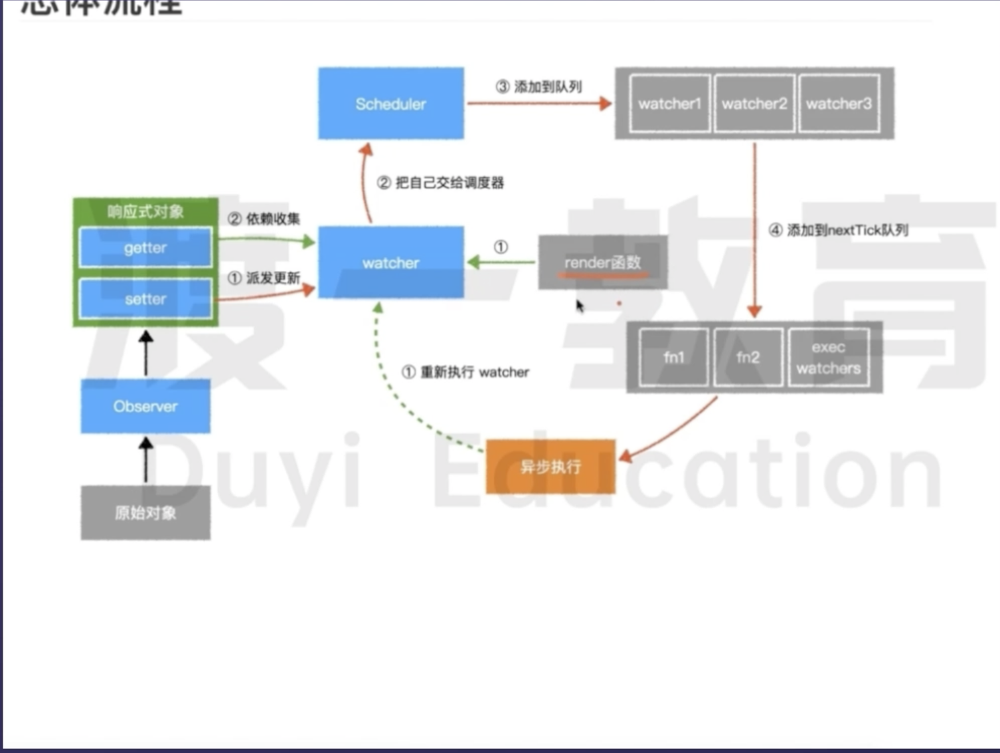

### 8.说一说对vue响应式的理解

1.所谓数据响应式就是能够使数据变化可以被检测并对这种变化做出响应的机制。
 2.MVVM框架中要解决的一个核心问题是连接数据层和视图层，通过数据驱动应用，数据变化，视图更新，要做到这点的就需要对数据做响应式处理，这样一旦数据发生变化就可以立即做出更新处理。

3.以vue为例说明，通过数据响应式加上虚拟DOM和patch算法，开发人员只需要操作数据，关心业务，完全不用接触繁琐的DOM操作，从而大大提升开发效率，降低开发难度

4.vue2中的数据响应式会根据数据类型来做不同处理，如果是对象则采用Object.definePropertyD的方式定义数据拦截，当数据被访问或发生变化时，我们感知并作出响应；如果是数组则通过覆盖数组对象原型的7个变更方法，使这些方法可以额外的做更新通知，从而作出响应。这种机制很好的解决了数据响应化的问题，但在实际使用中也存在一些缺点：比如初始化时的递归遍历会造成性能损失；新增或删除属性时需要用户使用

5.vue.set/delete这样特殊的api才能生效；对于es6中新产生的Map、Set这些数据结构不支持等问题。

6.为了解决这些问题，vue3重新编写了这一部分的实现：利用ES6的Proxy代理要响应化的数据，它有很多好处，编程体验是一致的，不需要使用特殊api，初始化性能和内存消耗都得到了大幅改善；另外由于响应化实现代码抽取为独立的reactivity包，使得我们可以更灵活的使用它，第三方的扩展开发起来更加灵活了。

> Object.defineProperty有两个参数，set和get,当render函数执行时，会触发get，收集依赖，当数据改变时，会触发set，会通知watcher去更新视图。

# 调度器 scheduler

vue2.0响应式原理

1. 当我们初始化一个数据data的时候，会实例化一个Observe类
2. 首先它会迭代遍历data中的每一个属性，并通过Object.defineProperty给遍历到的每一个属性添加上getter和setter方法
3. 当属性被读取的时候就会触发getter方法进行依赖(Wather)收集,当属性被修改的时候就会触发setter方法进行依赖(Wather)触发
4. 由一个调度器scheduler，创建一个队列，将需要执行的任务放入队列中，这个队列中存放了很多个watcher
5. 通过nextTick将队列中的任务放入微任务中，在微任务中执行队列中的任务

vue3.0 响应式原理

vue3中不同的是采用了ES6新增的Proxy进行代理操作，他提供了一个创建代理对象的构造函数，与vue2不同点就在于它会对整个对象进行监听和拦截，省去了每次迭代遍历data属性的性能开销，并且里面有内置的getter和setter方法，在被读取、赋值、删除属性等操作的时候触发getter方法进行依赖收集，在修改属性值的时候触发setter方法，对收集到的依赖进行触发。vue3里面我们一般通过两种方式来响应式处理一个数据，分别是ref和reactive，简单来讲，ref可以响应式处理原始数据类型和引用数据类型， ***但是reactive只可以处理对象，原因就在于Proxy只能接受一个对象作为参数。***